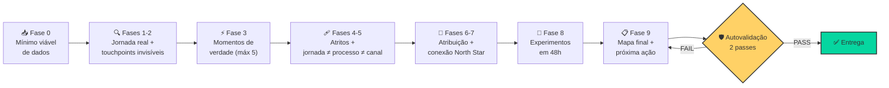

<div align="center">

# 🗺️ Jornada Invisível Mapper

### `Customer Journey` · `Invisible Touchpoints` · `Moments of Truth` · `Growth Intelligence`


**Uma skill de IA que mapeia a jornada que o cliente *vive* — não a que você *desenhou*.**

*An AI skill that maps the journey your customer *actually lives* — not the one you *drew on the whiteboard*.*

</div>

---

## 👋 O que é isso?

Skill de agente de IA (formato `.skill`) que transforma qualquer LLM em um **mapeador de jornada do cliente com rigor de auditoria**. Ela não gera fluxograma bonito para pendurar na parede — ela encontra os **touchpoints invisíveis** que decidem a venda e você não mede, os **3 a 5 momentos de verdade** onde a percepção do cliente é formada ou destruída, e os **atritos** que drenam receita sem aparecer em nenhum dashboard.

> **A jornada que você desenha no quadro branco é a jornada que VOCÊ quer ver.**
> **A jornada que o cliente vive é a que importa. A diferença entre as duas é onde o dinheiro some.**

Baseada no framework **Growth Intelligence** de **Fabrizzio Topper** — USP ESALQ MBX.

---

## 🧠 O que ela faz

| Capacidade | Na prática |
|---|---|
| 🔍 **Revela touchpoints invisíveis** | O amigo que disse "não compra lá", a pesquisa no concorrente às 3h da manhã, a memória de um atraso de 2 anos atrás — os 5 tipos de influência que não aparecem no seu CRM |
| ⚡ **Identifica momentos de verdade** | Filtro rigoroso: no máximo 3-5 por jornada. Se encontrou 15, está confundindo touchpoint com momento crítico |
| 🩹 **Prioriza atritos por ROI** | Matriz impacto × esforço com dono, horas, dependências e data de teste — não wishlist |
| 🧭 **Diferencia jornada ≠ processo ≠ canal** | O erro mais comum de mapeamento, corrigido com um teste de 3 perguntas |
| 📡 **Conecta com a North Star** | Cada momento de verdade vira driver com KPI e meta — mapa sem número é decoração |
| 🧪 **Testa em 48h, não em 3 meses** | Protocolo de experimentação: hipótese, amostra mínima, critério de decisão declarado ANTES de rodar |
| 🛡️ **Se audita antes de entregar** | Script determinístico + checklist com evidência citável. Número errado não passa |

---

## ⚙️ Como ela faz



### As 10 fases, em uma linha cada

| Fase | Nome | Pergunta que responde |
|---|---|---|
| 0 | Mínimo viável | "Tenho o suficiente para começar HOJE?" |
| 1 | Diagnóstico + **integridade do funil** | "O que a empresa acha vs. o que o cliente vive — e os números fecham?" |
| 2 | Touchpoints invisíveis | "O que decide a venda e eu não meço?" |
| 3 | Momentos de verdade | "Quais 3-5 pontos formam ou destroem a percepção?" |
| 4 | Atritos e oportunidades | "Onde o cliente gasta energia demais — e quanto vale consertar?" |
| 5 | Jornada ≠ processo ≠ canal | "Estou mapeando o cliente ou o meu organograma?" |
| 6 | Jornada fragmentada | "De onde a venda realmente veio?" |
| 7 | Conexão North Star | "Qual KPI cada momento de verdade move?" |
| 8 | Experimentação rápida | "Como valido em 7-14 dias sem consultoria de 3 meses?" |
| 9 | Síntese e ação | "Quem faz o quê, até quando, medindo o quê?" |

---

## 🛡️ O diferencial: autovalidação em 2 passes

A maioria das skills confia na própria memória. Esta não. Todo relatório passa por auditoria antes de sair:

### Passo 1 — Script determinístico (`validar_relatorio.py`)

```bash
python3 scripts/validar_relatorio.py relatorio.md
```

**7 checks que não dependem de interpretação de LLM:**

```
✓ Datas: nenhum prazo no passado
✓ Conversão acumulada: headline usa etapa EFETIVA, nunca nominal — e mostra a conta
✓ Divergências calc vs oficial: toda divergência exige veredito
✓ Gate de amostra: n < 100/variação = teste marcado DIRECTIONAL, sem exceção
✓ Taxonomia: só os 5 tipos oficiais de momento de verdade
✓ Prazos > 14 dias: exigem justificativa explícita
✓ Evidência fabricada: toda citação do checklist precisa EXISTIR no relatório
```

Qualquer `FAIL` = relatório **bloqueado**. Não se edita o script para passar — edita-se o relatório.

### Passo 2 — Checklist com evidência citável

Cada `[x]` exige prova colada (tabela, linha, valor). `[x]` sem evidência = item reprovado.

> **Checklist sem evidência é teatro de compliance.**

---

## 📊 O que você recebe

Não é um fluxograma colorido. É uma tabela de decisão:

| Etapa | Touchpoint Visível | Touchpoint **Invisível** | Emoção | KPI | Ação Prioritária | Dono | Teste A/B | Prazo |
|---|---|---|---|---|---|---|---|---|
| Contato | WhatsApp vendedor | Espera resposta sem ser lembrado | Desconfiança | Resposta em 2h ≥90% | SLA de 2h + notificação | Vendas/TI | 2h vs 24h | 7 dias |
| Pós-venda | Email genérico | Espera ligação que não vem | Esquecimento | Contato 48h ≥90% | Ligação obrigatória | CS | Ligação vs email | 7 dias |

\+ conversão acumulada **com a conta visível** — `100 descobertas → 22 compras = 22% (43 chegaram − 21 abandonaram)`, nunca o número nominal que fecha bonito mas fecha errado.

---

## 🔬 Battle-tested

Validada contra **3 cenários de stress** — do funil saudável à emergência operacional:

| Cenário | Perfil | O que a skill detectou |
|---|---|---|
| 🟢 **Ideal** | Jornada alinhada, KPIs acima da meta | **Viés de sobrevivência** no dataset (0% de abandono = só clientes que completaram) |
| 🟡 **Ambíguo** | Vende mas não fideliza | Funil real (45% de conversão efetiva, não 65% nominal) + atritos de alto ROI corrigíveis em dias |
| 🔴 **Hostil** | Lead bulk, NPS destruído, zero indicação | Emergência de processo, não de jornada — *"não escale o que está quebrado"* |

---

## 🧩 Ecossistema

Esta skill é 1 de 3 módulos do sistema **Growth Intelligence**:

| Skill | Pergunta |
|---|---|
| 🗺️ **jornada-invisivel-mapper** *(esta)* | **ONDE** agir |
| ⭐ `north-star-architect` | **O QUE** medir |
| 🚀 `growth-prompt-engineer` | **COMO** usar IA para agir mais rápido |

---

## 🚀 Como usar

1. Instale a skill no seu ambiente de agente (arquivo `.skill`)
2. Ative com contextos como: *"meu funil perde 40% no formulário"*, *"clientes elogiam mas não indicam"*, *"minha conversão caiu e ninguém sabe por quê"*
3. Forneça o mínimo viável: dados de comportamento (ou 3 entrevistas) + 1 persona viva
4. Receba o mapa auditado com próxima ação, dono e teste A/B

---

## 🎓 Referência

Framework **Growth Intelligence** — **Fabrizzio Topper**
USP ESALQ MBX · Programa de Growth

---
---

<div align="center">

# 🗺️ Invisible Journey Mapper *(EN)*

### `Customer Journey` · `Invisible Touchpoints` · `Moments of Truth` · `Growth Intelligence`

**An AI skill that maps the journey your customer actually lives — not the one you drew.**

</div>

### What it does

- 🔍 Reveals **invisible touchpoints** — the 5 types of unmeasured influence that decide the sale
- ⚡ Filters **3-5 moments of truth** per journey, with a strict taxonomy
- 🩹 Prioritizes friction by **ROI**, with owner, effort, dependencies and test date
- 🧭 Separates **journey ≠ process ≠ channel** with a 3-question test
- 📡 Connects every moment of truth to a **North Star driver** with KPI and target
- 🧪 Ships **48h experiments**, not 3-month mappings
- 🛡️ **Self-audits before delivering** — deterministic script + evidence-based checklist

### The differentiator: 2-pass self-validation

**Pass 1** — deterministic script (`validar_relatorio.py`): 7 checks covering past dates, nominal-vs-effective conversion math, calc-vs-official divergence verdicts, sample-size gating, taxonomy, deadline justification, and **fabricated evidence detection** (every checklist quote must exist in the report body).

**Pass 2** — evidence-based checklist: every `[x]` requires a pasted proof (table, line, value).

> **A checklist without evidence is compliance theater.**

### Battle-tested

Stress-tested against 3 scenarios — healthy funnel, ambiguous operation, and hostile/emergency — detecting survivorship bias, inflated conversion headlines, and broken processes that masquerade as journey problems.

### Credits

**Growth Intelligence** framework — **Fabrizzio Topper** · USP ESALQ MBX

---

<div align="center">

**Mapa sem número é decoração. Número sem auditoria é ficção.**

⭐ Feito para quem precisa de resultado na segunda-feira, não de consultoria de 3 meses.

</div>
